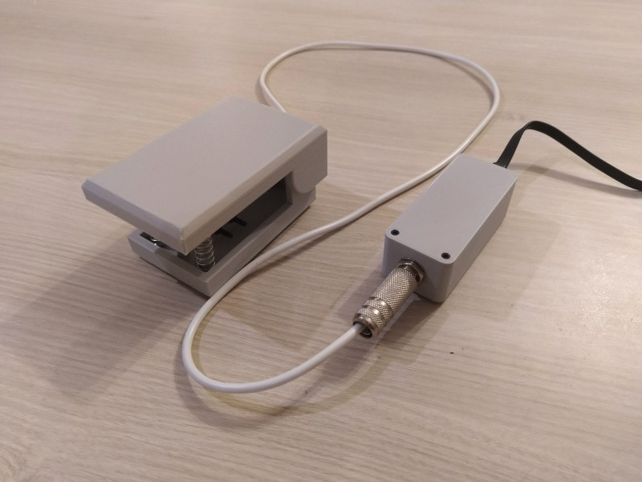
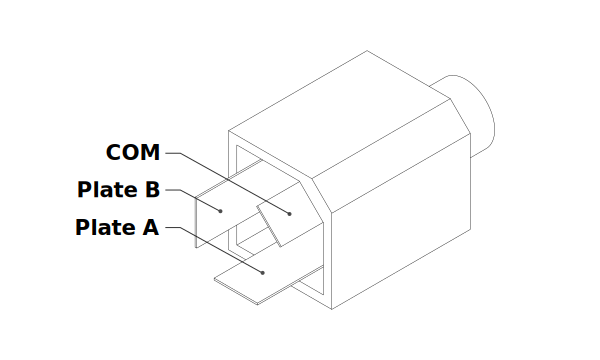

# ATTINY85 Pedal Switch

Pedal switch, which acts as a HID keyboard. Pressing pedal sends `x` key presses to the host.

  

## Setup

1. Burn fuses and reprogram Attiny
2. Connect according to the circuit from [Code and Life](https://codeandlife.com/2012/02/22/v-usb-with-attiny45-attiny85-without-a-crystal/) (skip LED out of PB3!)
3. Connect `COM` to `VCC`, Plate B to `PB4` and Plate A to `PB3`:
    

        
    
